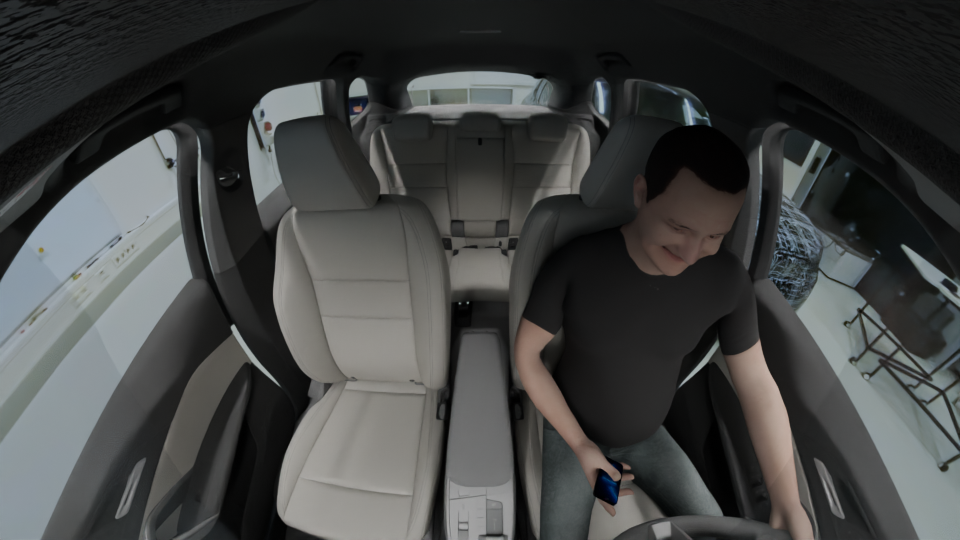
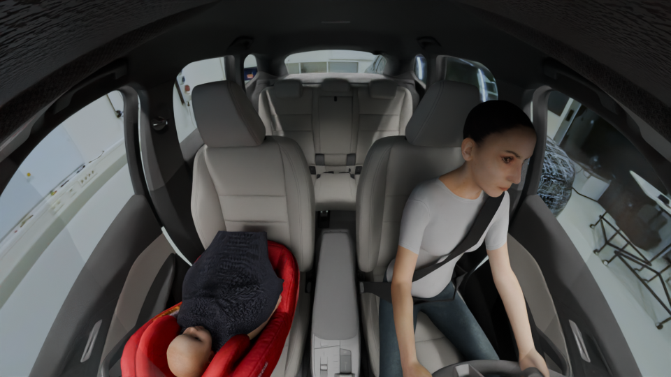

# ISU-Test: Search-based Testing of Vision Language Models for In-Car Scene Understanding

[](https://doi.org/10.1145/3832783.3834506)

<table align="center">
  <tr>
    <td></td>
    <td></td>
  </tr>
</table>

Find the edge cases: search-driven scenario generation and testing for vision-language in-car scene understanding.

## Overview

This project provides:
- Reproducible experiment wrappers and runner (`run_experiments_isu_*.sh`, `run_tests_isu.py`).
- Implementations of search algorithms and baselines (e.g., `nsga2`, random search).
- LLM integration layer and SUT adapters (e.g., `gpt5`, `moondream`, `gemini-2.5`).
- Scenario generation, simulation, and evaluation pipelines (feature configs, fitness, similarity, critical checks).
- Analysis and visualization scripts for experiment outputs.
- Config-driven setup for running reproducible, logged experiments.

## Main execution

Primary experiment wrapper scripts:

- [run_experiments_isu_gpt.sh](run_experiments_isu_gpt.sh): Runs experiments targeting `gpt5` SUT and related configurations.
- [run_experiments_isu_gemini.sh](run_experiments_isu_gemini.sh): Runs experiments for Gemini SUTs.
- [run_experiments_isu_dummy.sh](run_experiments_isu_dummy.sh): Quick/dummy experiment runner for local tests.

These scripts set variables used when invoking `run_tests_isu.py`, for example:

- `suts=("gpt5")` — list of SUTs to iterate over (examples: `gemini-2.5`, `moondream`, `isu-bmw`, `dummy`).
- `algorithms=("nsga2" "rs")` — algorithms to run (e.g., `nsga2`, `rs`).
- `budget="03:00:00"` — maximum runtime budget for each experiment.
- `script="run_tests_isu.py"` — main Python entrypoint invoked by the wrappers.
- `config_file="configs/isu_features.json"` — features/configuration file used by experiments.

Example invocation executed by the wrappers (shell snippet):

```bash
python $script \
  --sut "$sut" \
  --algorithm "$algorithm" \
  --population_size 20 \
  --n_generations 30 \
  --max_time $budget \
  --features_config "$config_file" \
  --seed $seed
```

## Repository structure

- [run_tests_isu.py](run_tests_isu.py): Core experiment runner used by shell wrappers.
- [run_experiments_isu_*.sh](run_experiments_isu_gpt.sh): Shell wrappers to automate runs and logging.
- [requirements.txt](requirements.txt): Python dependencies.
- [configs/isu_features.json](configs/isu_features.json): Feature configuration used for experiments.
- [get_analysis_isu.py](get_analysis_isu.py): Analysis entrypoint for experiment outputs.

Directories:

- `isu/` — ISU-specific modules (config, output handling, analysis, blender helpers, evaluation, simulation and SUT adapters).
  - `isu/analysis/` — analysis and plotting utilities.
  - `isu/eval/` — evaluation functions (fitness, similarity, critical checks).
  - `isu/model/` — model and scenario generation code.
  - `isu/simulation/` — simulators and prompts for SUTs.

- `llm/` — LLM integration layer, clients and adapters for different LLM providers.
  - `llm/algorithm/` — sampling and LLM-driven algorithms.
  - `llm/features/` — feature handlers and models.

- `opensbt/` — core OpenSBT abstractions, algorithms, utilities and visualization code.

- `run_experiments_isu_gpt.sh` (and siblings) — top-level experiment runners (described above).

## Usage

Edit the wrapper script variables at the top (for example `suts`, `algorithms`, `budget`, `script`, `config_file`, `repeat`) or run `run_tests_isu.py` directly. Example:

```bash
# from repo root
./run_experiments_isu_gpt.sh

# or run a single experiment directly
python run_tests_isu.py \
  --sut "gpt5" \
  --algorithm "nsga2" \
  --population_size 20 \
  --n_generations 30 \
  --max_time "03:00:00" \
  --features_config "configs/isu_features.json" \
  --seed 1
```

## Dataset

A generated dataset of interior scenes with ISU-Test will be provided soon.

## License

See [LICENSE](LICENSE) for licensing information.

## Citation

If you use **ISU-Test** in your research, please cite the accompanying ASE 2026 paper:

```bibtex
@inproceedings{sorokin2026isutest,
  author    = {Lev Sorokin and Chen Yang and Ken E. Friedl and Andrea Stocco},
  title     = {Search-based Testing of Vision Language Models for In-Car Scene Understanding},
  booktitle = {Proceedings of the 41st IEEE/ACM International Conference on Automated Software Engineering (ASE 2026), Industry Track},
  year      = {2026},
  doi       = {10.1145/3832783.3834506}
}
```

A preprint is available on arXiv: https://arxiv.org/abs/2607.02300

## Contact

Lev Sorokin \
lev.sorokin@bmw.de
